# Project CarND-Semantic-Segmentation-P2
Udacity Self-Driving Car Nanodegree - Semantic Segmentation Project

# Overview

The object of this project is to label the pixels of a road image using the Fully Convolutional Network (FCN) described in the [Fully Convolutional Networks for Semantic Segmentation](https://people.eecs.berkeley.edu/~jonlong/long_shelhamer_fcn.pdf) by Jonathan Long, Even Shelhamer, and Trevor Darrel. The project is based on the starting project provided by Udacity in [this repo](https://github.com/udacity/CarND-Semantic-Segmentation).

# Prerequisites

Based on Udacity's start project the following frameworks and packages should be installed to execute the code:

- [Python 3](https://www.python.org/)
- [TensorFlow](https://www.tensorflow.org/)
- [NumPy](http://www.numpy.org/)
- [SciPy](https://www.scipy.org/)

The dataset used in this project is the [Kitti Road dataset](http://www.cvlibs.net/datasets/kitti/eval_road.php). It could be download from [here](http://www.cvlibs.net/download.php?file=data_road.zip) or use the script [download_images.sh](./data/download_images.sh).

To train the FCN properly, I used the Udacity Workspace with a GPU instance.

# Code description

The code downloads a pre-trained VGG16 model and extract the input, keep probability, layer 3, layer 4 and layer 7 from it (method [`load_vgg`](./main.py#L22) from line 22 to line 46). Those layers are used in the [`layers`](./main.py#L51) to create the rest of the network:

- One convolutional layer with kernel 1 from VGG's layer 7 ([line 65](./main.py#L65)).
- One deconvolutional layer with kernel 4 and stride 2 from the first convolutional layer ([line 73](./main.py#L73)).
- One convolutional layer with kernel 1 from VGG's layer 4 ([line 85](./main.py#L85)).
- The two layers above are added to create the first skip layer ([line 93](./main.py#L93)).
- One deconvolutional layer with kernel 4 and stride 2 from the first ship layer ([line 96](./main.py#L96)).
- One convolutional layer with kernel 1 from VGG's layer 3 ([line 105](./main.py#L105)).
- The two layers above are added to create the second skip layer ([line 114](./main.py#L114)).
- One deconvolutional layer with kernel 16 and stride 8 from the second skip layer ([line 117](./main.py#L117)).

Every created convolutional and deconvolutional layer use a random-normal kernel initializer with standard deviation 0.01 and a L2 kernel regularizer with L2 0.001.

Once the network structure is defined, the optimizer and the cross-entropy lost is defined on the [`optimize`](./main.py#L128)(from line 128 to line 148) method using [Adam optimizer](https://en.wikipedia.org/wiki/Stochastic_gradient_descent#Adam).

The network is trained using the [`train_nn`](./main.py#L153) (from line 153 to line 189) with the following parameters.
- keep probability 0.5 
- learning rate 0.00001. 

To facilitate the loss value analysis, later on, every batch loss values are stored in an array, and the array is printed for each epoch.

# Training

The network training was done for 1, 5, 10, 20 and 40 epochs.

The last epoch loss were:

- 1 Epoch: 0.763117
- 5 Epochs: 0.265597
- 10 Epochs: 0.159250
- 20 Epochs: 0.087260
- 40 Epochs: 0.046232

# Sample images

The semantic segmentation improves when the epochs increase.

## 1 Epoch

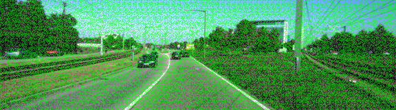
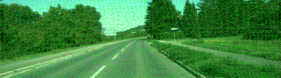

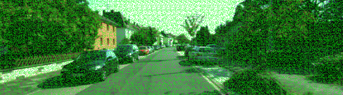

## 5 Epochs

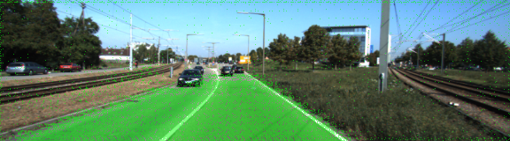

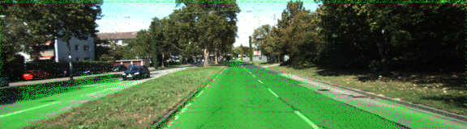
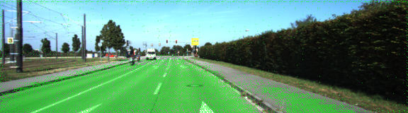
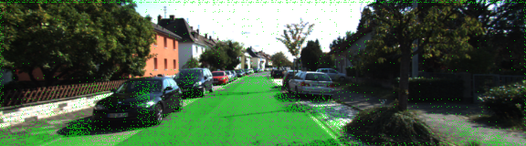
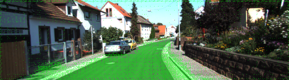

## 10 Epochs

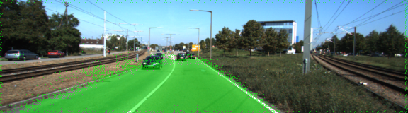
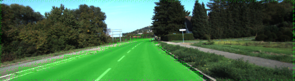
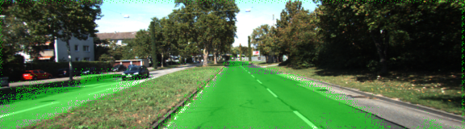

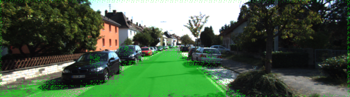
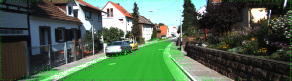

## 20 Epochs

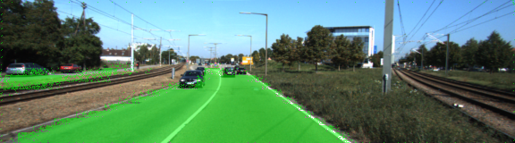
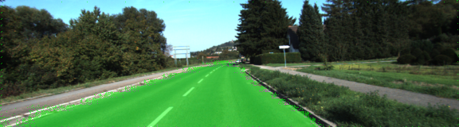
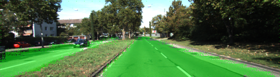

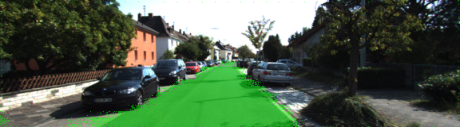

## 40 Epochs

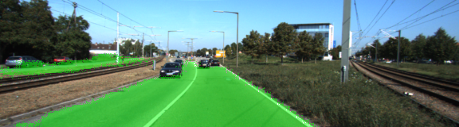
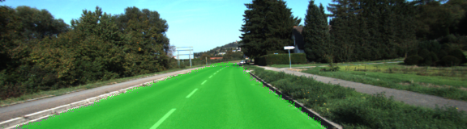

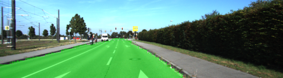
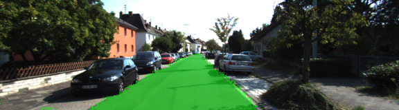

