# Project CarND-Semantic-Segmentation-P2
Udacity Self-Driving Car Nanodegree - Semantic Segmentation Project

# Overview

The object of this project is to label the pixels of a road image using the Fully Convolutional Network (FCN) described in the [Fully Convolutional Networks for Semantic Segmentation](https://people.eecs.berkeley.edu/~jonlong/long_shelhamer_fcn.pdf) by Jonathan Long, Even Shelhamer, and Trevor Darrel. The project is based on the starting project provided by Udacity in [this repo](https://github.com/udacity/CarND-Semantic-Segmentation).

# Prerequisites

Based on Udacity's start project the following frameworks and packages should be installed to execute the code:

- [Python 3](https://www.python.org/)
- [TensorFlow](https://www.tensorflow.org/)
- [NumPy](http://www.numpy.org/)
- [SciPy](https://www.scipy.org/)


The dataset used in this project is the [Kitti Road dataset](http://www.cvlibs.net/datasets/kitti/eval_road.php). It could be download from [here](http://www.cvlibs.net/download.php?file=data_road.zip) or use the script [download_images.sh](./data/download_images.sh).

To train the FCN properly, I used the Udacity Workspace with a GPU instance.

# Code description

The code downloads a pre-trained VGG16 model and extract the input, keep probability, layer 3, layer 4 and layer 7 from it (method [`load_vgg`](./main.py#L22) from line 22 to line 46). Those layers are used in the [`layers`](./main.py#L51) to create the rest of the network:

- One convolutional layer with kernel 1 from VGG's layer 7 ([line 65](./main.py#L65)).
- One deconvolutional layer with kernel 4 and stride 2 from the first convolutional layer ([line 73](./main.py#L73)).
- One convolutional layer with kernel 1 from VGG's layer 4 ([line 85](./main.py#L85)).
- The two layers above are added to create the first skip layer ([line 93](./main.py#L93)).
- One deconvolutional layer with kernel 4 and stride 2 from the first ship layer ([line 96](./main.py#L96)).
- One convolutional layer with kernel 1 from VGG's layer 3 ([line 105](./main.py#L105)).
- The two layers above are added to create the second skip layer ([line 114](./main.py#L114)).
- One deconvolutional layer with kernel 16 and stride 8 from the second skip layer ([line 117](./main.py#L117)).

Every created convolutional and deconvolutional layer use a random-normal kernel initializer with standard deviation 0.01 and a L2 kernel regularizer with L2 0.001.

Once the network structure is defined, the optimizer and the cross-entropy lost is defined on the [`optimize`](./main.py#L128)(from line 128 to line 148) method using [Adam optimizer](https://en.wikipedia.org/wiki/Stochastic_gradient_descent#Adam).

The network is trained using the [`train_nn`](./main.py#L153) (from line 153 to line 189) with the following parameters.
- keep probability 0.5 
- learning rate 0.00001. 

To facilitate the loss value analysis, later on, every batch loss values are stored in an array, and the array is printed for each epoch.

# Training

The network training was done for 5, 10, 20 and 40 epochs.

The last epoch loss were:

- 5 Epochs: 0.265597
- 10 Epochs: 0.159250
- 20 Epochs: 0.049151
- 40 Epochs:

# Sample images

The semantic segmentation improves when the epochs increase.

## 5 Epochs

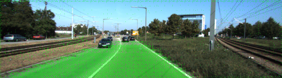

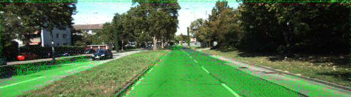
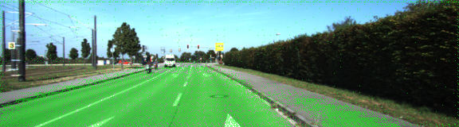
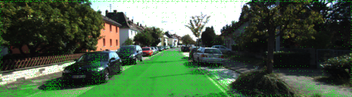
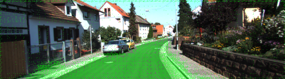

## 10 Epochs

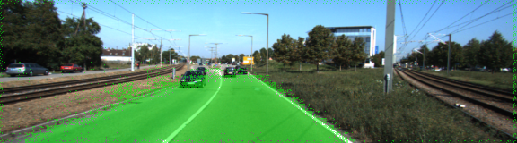
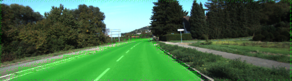
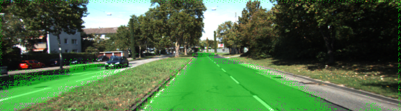

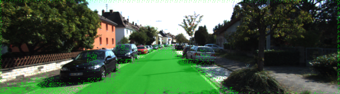
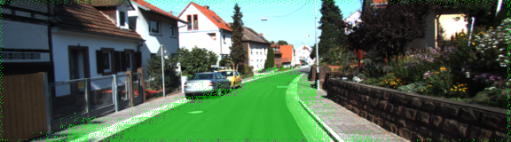

## 20 Epochs

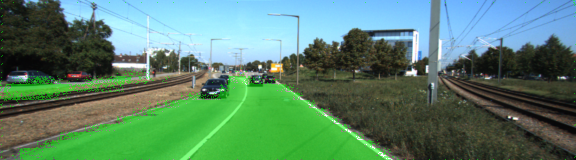
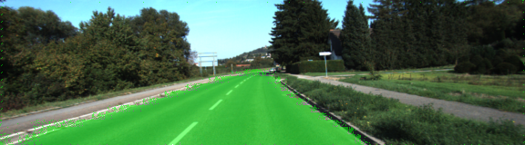
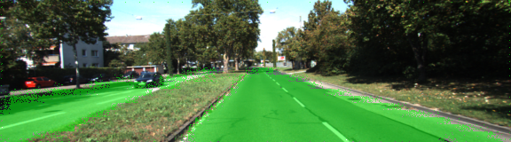

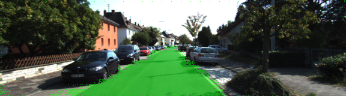
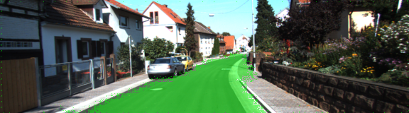

## 40 Epochs


# Semantic Segmentation
### Introduction
In this project, you'll label the pixels of a road in images using a Fully Convolutional Network (FCN).

### Setup
##### GPU
`main.py` will check to make sure you are using GPU - if you don't have a GPU on your system, you can use AWS or another cloud computing platform.
##### Frameworks and Packages
Make sure you have the following is installed:
 - [Python 3](https://www.python.org/)
 - [TensorFlow](https://www.tensorflow.org/)
 - [NumPy](http://www.numpy.org/)
 - [SciPy](https://www.scipy.org/)
##### Dataset
Download the [Kitti Road dataset](http://www.cvlibs.net/datasets/kitti/eval_road.php) from [here](http://www.cvlibs.net/download.php?file=data_road.zip).  Extract the dataset in the `data` folder.  This will create the folder `data_road` with all the training a test images.

### Start
##### Implement
Implement the code in the `main.py` module indicated by the "TODO" comments.
The comments indicated with "OPTIONAL" tag are not required to complete.
##### Run
Run the following command to run the project:
```
python main.py
```
**Note** If running this in Jupyter Notebook system messages, such as those regarding test status, may appear in the terminal rather than the notebook.

### Submission
1. Ensure you've passed all the unit tests.
2. Ensure you pass all points on [the rubric](https://review.udacity.com/#!/rubrics/989/view).
3. Submit the following in a zip file.
 - `helper.py`
 - `main.py`
 - `project_tests.py`
 - Newest inference images from `runs` folder  (**all images from the most recent run**)
 
 ### Tips
- The link for the frozen `VGG16` model is hardcoded into `helper.py`.  The model can be found [here](https://s3-us-west-1.amazonaws.com/udacity-selfdrivingcar/vgg.zip).
- The model is not vanilla `VGG16`, but a fully convolutional version, which already contains the 1x1 convolutions to replace the fully connected layers. Please see this [post](https://s3-us-west-1.amazonaws.com/udacity-selfdrivingcar/forum_archive/Semantic_Segmentation_advice.pdf) for more information.  A summary of additional points, follow. 
- The original FCN-8s was trained in stages. The authors later uploaded a version that was trained all at once to their GitHub repo.  The version in the GitHub repo has one important difference: The outputs of pooling layers 3 and 4 are scaled before they are fed into the 1x1 convolutions.  As a result, some students have found that the model learns much better with the scaling layers included. The model may not converge substantially faster, but may reach a higher IoU and accuracy. 
- When adding l2-regularization, setting a regularizer in the arguments of the `tf.layers` is not enough. Regularization loss terms must be manually added to your loss function. otherwise regularization is not implemented.
 
### Using GitHub and Creating Effective READMEs
If you are unfamiliar with GitHub , Udacity has a brief [GitHub tutorial](http://blog.udacity.com/2015/06/a-beginners-git-github-tutorial.html) to get you started. Udacity also provides a more detailed free [course on git and GitHub](https://www.udacity.com/course/how-to-use-git-and-github--ud775).

To learn about REAMDE files and Markdown, Udacity provides a free [course on READMEs](https://www.udacity.com/courses/ud777), as well. 

GitHub also provides a [tutorial](https://guides.github.com/features/mastering-markdown/) about creating Markdown files.
